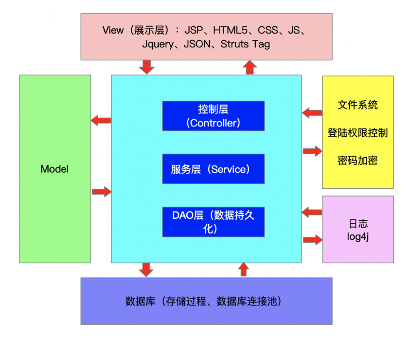
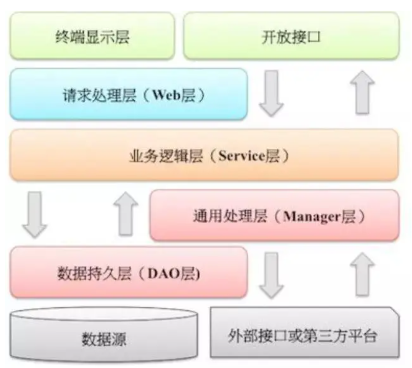
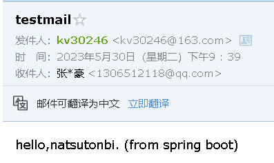
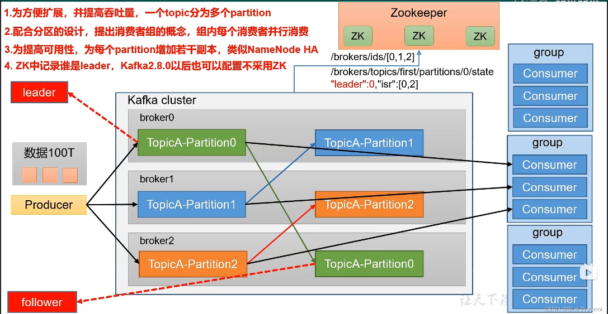

# 综设项目2

## 用户管理服务

### 一、需求分析

1. 用户注册
2. 用户登录
3. 鉴权&权限管理
   1. 总管理员: 最高权限,主要在整体上进行管理
   2. 组管理员: 组内权限,控制消息具体推送
   3. 普通用户: 修改自己的信息,修改密码,注销等等
4. 系统管理
   1. 资源调度: 服务器资源有限, 应该有相应管理程序来调度资源, 根据用户和任务的优先级和服务要求来设计调度方式
   2. 日志管理: 监控用户行为, 及时发现异常行为, 方便后续溯源; 对上一项服务执行情况进行监控, 如最终执行情况, 效率, 资源占用等, 方便后续优化

---

### 用户登录/注册

目前只采用本网站独立的注册登录

- 账号&密码
- 手机验证
- 邮箱登录
- 第三方账号登录

### 用户管理

1. Group
     - 组内消息互通
     - 组内数据资源互通&相关资源下发
2. User
     - token管理: 目前采用jwt简单实现了一下
     - 消息推送: 采用消息队列对消息进行管理
     - 权限管理: 以权限表的形式存储在数据库中

采取"user-role-auth", user作为实际账号实体，role为权限的集合，auth为独立的权限
user可以拥有很多role，role也能有很大auth，而且实际数量是很难衡量的，并且可以有期限
在对url进行访问控制时，整体上以role限行，但也支持user/group和auth限行

(实际上有的界面需要登录访问就是最低程度的鉴权了)

基础行为：

- 访问url
- 修改资源(上传，启用，禁用等)
- 修改他人权限

实际上的名称可以多样化，以上只是模板比如上传文本实际上可以是“发布帖子”或者“发表评论”

### 数据库方面

#### 登录表

登录验证核心

- username(不可重复)
- createtime
- salt(char[16]: 16进制字符串)
- password(md5加密char[32]16进制字符串)
- nickname(可重复)

登录控制

- ~~status(正常、冻结、风控、不可用/注销)~~

关联账号(可以有多个，但通告消息只能有一个)

- tel(list)
- email(list)
- social account(list)
- status(list——可设置冻结状态，不可登录；风控，更加频繁地登录验证)

#### 权限表

权限相当于是一把钥匙
操作：

- on user
  - 用户账号状态设置
  - 创建用户组group
    - 无条件
    - 需上级审核
    - 无权限
  - group加入用户
    - 无条件
    - 需上级审核
    - 需受邀用户同意
- on resource
  - 设置可见(访客,登录用户,)

1. user
   - uuid
   - privilege(list)
     - action
     - url/object
     - aothorizer
     - begin time
     - end time
   - role(list)
     - role name
     - aothorizer
     - begin time
     - end time
   - group(list)
2. group
   - guid
   - user(list)
   - group privilege(list)
   - group role(list)
   - creator
3. role
   - role name
   - privilege(list)
   - creator
   - begin time
   - end time

基础角色:

- root: 所有操作
- group owner: (on certain group) 委任manager+所有manager权限
- group manager: 邀请成员
- group member: (需要manager同意): 邀请成员; 向组员发送消息、通告消息

#### 配置表

在赋予role时可能会有冲突，比如一个人不可能既是研究生也是本科生
冲突表由管理员设置，赋予role时查询冲突表

---

## 技术选择

### 后端

- 基础框架：Springboot (目前3.0)
- 持久层框架：Mybatis Plus
- 安全框架：Apache Shiro(暂定)
- 模板引擎：Thymeleaf
- 数据库连接池：Druid(暂定)
- 缓存框架：Ehcache(暂定)
- 日志打印：logback(暂定)，Slf4j
- 其他：fastjson，poi，javacsv，quartz等。(均暂定)

### 前端(暂定)

- 基础框架：Bootstrap
- JavaScirpy框架：jQuery
- 消息组件：Bootstrap notify
- 提示框插件：SweetAlert2
- 树形插件：jsTree
- 树形表格插件：jqTreeGrid
- 表格插件：BootstrapTable
- 表单校验插件：jQuery-validate
- 多选下拉框插件：multiple-select
- 图表插件：Highcharts

---

## SpringBoot

SpringBoot是一个基于Java的开源框架，用于**创建微服务**。它由Pivotal Team开发，用于构建**独立的生产就绪Spring应用**。 SpringBoot 的设计是为了让你**尽可能快**的跑起来 Spring 应用程序并且尽可能**减少你的配置文件**，简化开发。

### SpringBoot三层架构



1. Controller——客服
   负责**控制业务逻辑**（例如登陆控制等具体的业务模块逻辑控制）。处理Web前端收发数据。通过调用Service层里面的接口控制具体的业务**流程**
   1. @Controller: 标注于类体上，声明该类是Controller
   2. @RequestMapping: 标注于方法体上，用于指定url
   3. @ResponseBody: 标注于方法体上，用于返回数据到\<body>标签
2. Service——后台
   负责**业务模块的逻辑应用设计**。一般先设计所需的业务接口类，之后再通过类来实现该接口，然后在Config文件中进行配置其实现的关联。之后就可以在Service层调用接口进行业务逻辑应用的处理。有利于业务逻辑的独立性和重复利用性。
   1. @Service: 标注于Service接口的实现类上，将当前类自动注入到Spring容器中
3. Dao(Data Access Object)——后勤
   负责**数据持久化工作**。与数据库进行交互，**封装**对数据库的访问
   1. @Mapper

阿里相关架构如下


此图是很契合目前项目的

- 终端显示层使用日志控制
- 开放接口遵守RestAPI规范，可以涉及前端网页制作
- 请求处理即前Controller
- 业务逻辑和DAO易知
- 而Manager包括:
  - 第三方平台封装，预处理返回结果及转化异常信息
  - Service层通用能力的下沉，如缓存方案、中间件通用处理
  - 与DAO层交互，对多个DAO的组合复用

---

## MailSend

导入依赖

```bash
<dependency>
   <groupId>org.springframework.boot</groupId>
   <artifactId>spring-boot-starter-mail</artifactId>
</dependency>
```

1. 从邮件服务器获取邮件服务，如smtp（这里以网易邮箱为例）
2. 配置application.yml

```yml
spring:
  mail:
    host: smtp.163.com
    username: xxxx@163.com
    password: xxxxxxxx
```

测试simplemailSender

```java
@Autowired
mailService mailServ;
@Test
public void simpleMailTest(){
mailServ.sendSimpleMail("1306512118@qq.com", "testmail", "hello,natsutonbi. (from spring boot)");
}
```



---

## Kafka

基础：zookeeper是一个分布式协调服务，解决多个进程间的同步限制，防止分布式锁

分布式、具有高吞吐量、pub/sub模式

消息消费模式还有p2p

### 应用场景

- 缓存
- 削峰
- 解耦
- 异步通信

消息队列的pub/sub模式分topic
由于分布式负载均衡，topic分partition
容错加副本，因此分leader和follower，后者只做备份，有机会成为leader


注意修改server.properties
brokeid在集群中唯一
log_dir默认为/tmp/kafka，需修改到非临时目录
zookeeper.connect为集群 host1:port,host2:port,host3:port/dir——设置zookeeper方便查找

创建topic

```bash
cd /usr/local/kafka-cluster/kafka1/bin/
./kafka-topics.sh --create --zookeeper 172.17.80.219:2181 --replication-factor 2 --partitions 2 --topic topic1
```

---

- ## todo

  - [x] 用户登录
  - [x] mybatis plus应用
  - [x] 用户注册
  - [x] 邮件发送
  - [ ] 操作分权
  - [ ] kafka消息队列
  - [ ] swagger文档构建与维护

---

### Note

1. Rest API
   协议://ip或域名:端口/版本/模块/子模块域/REST API
2. RPC: Remote Process Call, 远程过程调用，分同步/异步
3. cookie&session
   - cookie存在客户端，约4K
   - session存在服务端，相当于为了避免频繁查数据库，默认30min，在服务器内存里，sessionId在客户端，默认存cookie，禁用cookie则url重写；session有分布式问题，可以采取
     - 粘性访问，同一个ip给之前的服务器，但有负载均衡问题
     - 同步session，服务器间备份
     - 共享session，其他服务器向存有session的服务器查询
     - 存到数据库，数据库来做集群
4. 配置文件加密

   使用插件

   ```xml
   <plugin>
      <groupId>com.github.ulisesbocchio</groupId>
      <artifactId>jasypt-maven-plugin</artifactId>
      <version>3.0.3</version>
   </plugin>
   ```

   加密内容用DEC()包裹起来

   ```yml
   spring:
      datasource:
         driver-class-name: com.mysql.cj.jdbc.Driver
         url: jdbc:mysql://114.51.4.0:3306
         username: test
         password: DEC(123456)
   jasypt:
      encryptor:
         password: didispace
   ```

   终端执行命令加密，而且运行时会解密读出

   ```bash
   mvn jasypt:encrypt -Djasypt.encryptor.password=didispace
   ```

   对于yml文件

   ```bash
   mvn jasypt:encrypt -Djasypt.plugin.path="file:src/main/resources/application.yml" -Djasypt.encryptor.password="didispace"
   ```

   解密只在终端输出配置文件，不会修改配置文件

   ```bash
   mvn jasypt:decrypt -Djasypt.encryptor.password=didispace
   ```

   对于yml文件

   ```bash
   mvn jasypt:decrypt -Djasypt.plugin.path="file:src/main/resources/application.yml" -Djasypt.encryptor.password="didispace"
   ```

   在实际应用的过程中，jasypt.encryptor.password的配置，可以通过环境变量或启动参数中注入，而不是在配置文件中指定
[jasypt参考](https://github.com/ulisesbocchio/jasypt-spring-boot)

---

目前账户

|username   |password   |nickname   |
|----|----|----|
|root|123456|admin
|3619146277322752|123456|natsutonbi
|3621404104720384|123456|natsutonbi2

---

打包命令

```bash
mvnw.cmd clean package
```

查看端口占用

```bash
lsof -i:port
```
