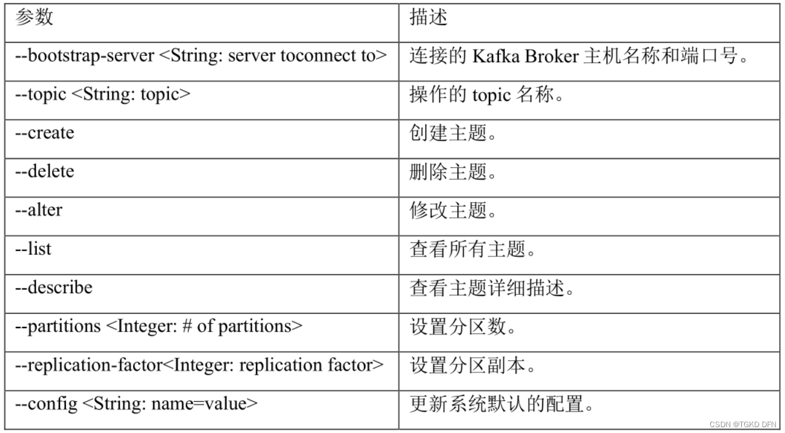

# Notes

## 日志

默认SLF4J + Logback
为什么不用System.out.println()

- 实际上这是一个同步方法，高并发会严重影响性能
- 输出日志难采集

### 远程日志平台

#### Kibana

开源分析可视化平台，对接ES

### QA

#### 输出日志类和行号显示?

原因：输出文件以及行号信息需要 stacktrace 获取 callerdata，因为性能原因 logback 的 AsyncAppender 默认是不记录该信息。即默认为 false
[官方文档](https://logback.qos.ch/manual/appenders.html#AsyncAppender)
解决：在配置的AsyncAppender中添加

```xml
<includeCallerData>true</includeCallerData>
```

## Admin

- admin-server负责收集数据，应该拆分出来
- admin-client负责开放性能数据，实际应用的可选

## Actuator

远程控制

Spring Boot Actuator 模块提供了生产级别的功能，比如健康检查，审计，指标收集，HTTP 跟踪等，帮助我们监控和管理Spring Boot 应用。
Actuator使用Micrometer与这些外部应用程序监视系统集成。这样一来，只需很少的配置即可轻松集成外部的监控系统。

默认访问<http://hostname:port/actuator>，查看暴露出来actuator的端点

```json
{
   "_links":{
      "self":{
         "href":"http://127.0.0.1:8080/actuator",
         "templated":false},
         "health":{
            "href":"http://127.0.0.1:8080/actuator/health","templated":false
         },
         "health-path":{
            "href":"http://127.0.0.1:8080/actuator/health/{*path}",
            "templated":true
         }
   }
}
```

配置

```properties
#/actuator/**变/manage/**
management.endpoints.web.base-path=/manage

# 开启所有endpoints(不包含shutdown)
management.endpoints.web.exposure.include=*
# include: '*'

# 开启指定的endpoint
management.endpoints.web.exposure.include=beans,mappings
# include: ["health","info","beans","mappings","logfile","metrics","shutdown","env"]
 
# exclude可以用來关闭某些endpoints
# exclude通常跟include一起用，就是先include了全部，再exclude部分
management.endpoints.web.exposure.exclude=beans
management.endpoints.web.exposure.include=*
 
# 如果要开启/actuator/shutdown
management.endpoint.shutdown.enabled=true
```

```yml
# actuator 监控配置
management:
  #actuator端口 如果不配置做默认使用上面8080端口
   server:
      port: 8080
   endpoints:
      web:
         exposure:
            #默认值访问health,info端点  用*可以包含全部端点
            include: "*"
         #修改访问路径 2.0之前默认是/; 2.0默认是/actuator可以通过这个属性值修改
         base-path: /actuator
   endpoint:
      shutdown:
         enabled: true #打开shutdown端点
      health:
         show-details: always #获得健康检查中所有指标的详细信息，不设置就一个status:up
```

端口参考[API文档](https://docs.spring.io/spring-boot/docs/3.1.1/actuator-api/htmlsingle/)

loggers临时修改日志级别

metrics可查看可监控属性

```text
访问http://localhost:8080/actuator/metrics
选择一个属性查看http://localhost:8080/actuator/metrics/executor.pool.core
```

### warn

spring-boot-actuator-logview老版本(0.2.13)有目录遍历漏洞

## spring-security

一般的推荐方案是：

- SSM + Shiro
- Spring boot/Spring Cloud + Spring Security

spring-security使用过滤器链保护资源
... 登入系统 ... 异常翻译(处理) 权限鉴别
无设置时在控制台输出user的默认密码
认证+授权

### 核心组件

1. SecurityContextHolder
   安全上下文默认threadLocal，与线程绑定，线程退出时清除
2. SecurityContext
   主要持有Authentication对象
3. Authentication（接口）
   主要包含了用户的详细信息（UserDetails）和用户鉴权时所需要的信息，如用户提交的用户名密码、Remember-me Token，或者digest hash值等，按不同鉴权方式使用不同的Authentication实现

### PasswordEncoder

- 默认会{id}pwd根据id将上层传入密码编码后和数据库中的pwd进行对比
- sb推荐使用BCryptPasswordEncoder注入

#### 动态MD5盐值验证

Q:

1. security 框架提供的几个加密\解密工具没有MD5的方式
   自定义加解密注入配置类 implements PasswordEncoder

   ```java
   import cn.hutool.crypto.SecureUtil;
   import com.ichinae.imis.gateway.utils.SaltUtil;
   import org.springframework.security.crypto.codec.Utf8;
   import org.springframework.security.crypto.password.PasswordEncoder;
   import java.security.MessageDigest;

   /**
    * 自定义加密解密
    */
   public class MD5PasswordEncoder implements PasswordEncoder {

      @Override
      public String encode(CharSequence charSequence) {
         String salt = SaltUtil.generateSalt();
         return SecureUtil.md5(SecureUtil.md5(charSequence.toString()) + salt);
      }

      @Override
      public boolean matches(CharSequence charSequence, String encodedPassword) {
         byte[] expectedBytes = bytesUtf8(charSequence.toString());
         byte[] actualBytes = bytesUtf8(charSequence.toString());
         return MessageDigest.isEqual(expectedBytes, actualBytes);
      }

      private static byte[] bytesUtf8(String s) {
         // need to check if Utf8.encode() runs in constant time (probably not).
         // This may leak length of string.
         return (s != null) ? Utf8.encode(s) : null;
      }
   }
   ```

2. security 配置加密\解密方式的时候，无法填入动态的账号的加密盐
   可以在UserDetailsService接口的findByUsername()方法中，在返回UserDetails实现的时候，使用默认实现User的UserBuilder内部类来解决这个问题，因为UserBuilder类中有一个属性，passwordEncoder属性，它是Fucntion<String, String>类型的，默认实现是 password -> password，即对密码不做任何处理

### note

- 在 Spring Security 5.7.0-M2 中，弃用了 WebSecurityConfigurerAdapter，Spring 鼓励用户转向基于组件的安全配置。

网上很多解决办法都过时了比如还在使用WebSecurityConfigurerAdapte，antMatchers

```java
//旧方法
@Configuration
public class SecurityConfiguration extends WebSecurityConfigurerAdapter {
    @Override
    protected void configure(HttpSecurity http) throws Exception {
        http
            .authorizeHttpRequests((authz) -> authz
                .anyRequest().authenticated()
            )
            .httpBasic(withDefaults());
    }
}
```

推荐的方法是注册一个 SecurityFilterChain bean：
filter(res,req) servlet intecreptor controller

```java
@Configuration
public class SecurityConfiguration {
    @Bean
    public SecurityFilterChain filterChain(HttpSecurity http) throws Exception {
        http
            .authorizeHttpRequests((authz) -> authz
                .requestMatchers("/", "/home").permitAll()
                 //放行静态资源
                .requestMatchers("/resources/**").permitAll()
                .anyRequest().authenticated()
            )
            .httpBasic(withDefaults())
            .formLogin((form) -> form
                .loginPage("/login")
                .permitAll()
            )
            .logout((logout) -> logout.permitAll());
        return http.build();
    }
}
```

## docker

### 安装

```bash
apt update
apt-get install ca-certificates curl gnupg lsb-release

curl -fsSL http://mirrors.aliyun.com/docker-ce/linux/ubuntu/gpg | sudo apt-key add -

sudo add-apt-repository "deb [arch=amd64] http://mirrors.aliyun.com/docker-ce/linux/ubuntu $(lsb_release -cs) stable"

sudo apt-get install docker-ce docker-ce-cli containerd.io
```

## Mybatis-plus

### 基于注解

1. 引入依赖

   ```xml
   <dependency>
      <groupId>com.baomidou</groupId>
      <artifactId>mybatis-plus-boot-starter</artifactId>
      <version>3.5.3.1</version>
   </dependency>
   ```

2. 设计entity(数据实体)

   ```java
   @TableName("`GradeDB`.`GRADE`")
   public class gradeItem
   {
      public int SID,CID;
      public float Score;
      public String Note;
   }
   ```

3. 设计mapper(此即DAO层)

   ```java
   @Mapper
   public interface gradeMapper extends BaseMapper<gradeItem>{

      @Select("SELECT * FROM `GradeDB`.`GRADE`")
      List<gradeItem> getAll();

      @Select("SELECT * FROM `GradeDB`.`GRADE` WHERE `SID` = #{SID} AND `CID` = #{CID}")
      List<gradeItem> findBy_SID_CID(@Param("SID") String SID,@Param("CID") String CID);

      @Insert("INSERT INTO `GradeDB`.`GRADE` (`SID`, `CID`, `Score`, `Note`) VALUES(#{grade.SID}, #{grade.CID}, #{grade.Socre}, #{grade.Note})")
      int insert(@Param("grade") gradeItem grade);

      }
   ```

4. 使用默认查询

   ```java
   LambdaQueryWrapper<User> queryWrapper=new LambdaQueryWrapper<>();
   queryWrapper.eq(User::getUsername,username);
   usermapper.selectList(queryWrapper);
   User user=usermapper.selectOne(queryWrapper);
   if(Objects.isNull(user)) throw new RuntimeException("未找到用户");
   ```

### 基于配置

主类
@MapperScan("com.xxx.mapper")//扫描对应包

---

## 静态资源访问

url访问默认顺序
classpath:/META-INF/resources/,classpath:/resources/,classpath:/static/,classpath:/public/

```yml
spring:
   mvc:
      static-path-pattern: /res/** 
      #访问静态资源path模式，默认是/**
      #url先交给controller，不能处理再交给静态资源管理器
      #默认可访问resources目录下的resources、public、static、META-INF/resources
      #html,图片什么的能浏览器打开的就打开，其他下载
   web:
      resources:
         static-locations: #指定resources目录下哪些还能访问
         - classpath:/mypath
```

resource文件夹位置也可以在pom改，默认为src/main/resources

```xml
<resources>
     <resource>
         <directory>src/main/resources</directory>
     </resource>
</resources>
```

也可以在代码中改

```java
@Configuration
public class PublicMvcConfig extends WebMvcConfigurerAdapter {
 
    @Override
    public void addResourceHandlers(ResourceHandlerRegistry registry) {
        registry.addResourceHandler("/public/**")
                .addResourceLocations("classpath:/public/");
    }
}
```

项目内读取文件

```java
import org.springframework.core.io.ResourceLoader;
import org.springframework.core.io.Resource;

@Autowired
private ResourceLoader resourceLoader;

Resource resource = resourceLoader.getResource("classpath:\\...");//注意不能是'/'

EasyExcelFactory.read(resource.getInputStream())//excel读取
File f=resource.getFile();
```

```java
public interface Resource extends InputStreamSource
{
/**
 * 判断资源在物理上是否存在
 */
boolean exists();

/**
 * 表明该资源中的非空内容是否可以通过getInputStream()读取
 */
default boolean isReadable(){
return exists();
}

/**
 * 表明该资源是否被一个打开的stream处理
 */
default boolean isOpen() {
return false;
}

/**
 * 判断该资源是否代表文件系统中的一个文件
 */
default boolean isFile() {
return false;
}

/**
 * 返回该资源的URL
 */
URL getURL() throws IOException;

/**
 * 返回该资源的URI
 */
URI getURI() throws IOException;

/**
 * 返回该资源对应的File
 */
File getFile() throws IOException;

/**
 * 返回一个ReadableByteChannel（可读的字节流通道）
 */
default ReadableByteChannel readableChannel() throws IOException {
return Channels.newChannel(getInputStream());
}

/**
 * 返回资源中内容的长度
 */
long contentLength() throws IOException;

/**
 * 返回该资源的最后修改时间
 */
long lastModified() throws IOException;

/**
 * 创建一个和该资源相关的资源
 */
Resource createRelative(String relativePath) throws IOException;

/**
 * 返回文件名
 */
@Nullable
String getFilename();

/**
 * 返回资源的描述
 */
String getDescription();
}
```

---

## Kafka

### 安装和配置

1. 到kafka官网下载tar包(可用wget)，解压
2. 设置broker.id为节点id(集群内不能重复)

#### maven

```xml
<dependency>
   <groupId>org.springframework.kafka</groupId>
   <artifactId>spring-kafka</artifactId>
</dependency>
```

#### application.yml

### 使用

创建topic

```bash
cd ./kafka1/bin/
./kafka-topics.sh --bootstrap-server localhost:9092 --list #查看所有
./kafka-topics.sh --bootstrap-server localhost:9092 --create --partitions 1 --replication-factor 1 --topic first #创建topic
./kafka-topics.sh --bootstrap-server localhost:9092 --describe --topic first #查看描述
./kafka-topics.sh --bootstrap-server hadoop102:9092 --alter --topic first --partitions 3 #修改分区数
./kafka-topics.sh --bootstrap-server hadoop102:9092 --delete --topic first #删除topic
```



## tmux

- 新建会话[并运行命令]：tmux new -s name [cmd]
- 断开会话：tmux detach
- 进入会话：tmux a -t name
- 关闭会话：
  - tmux kill-session -t name
  - tmux kill-server #关闭所有
- 查看会话：tmux ls

tmux new -s kafka ./bin/kafka-server-start.sh ./config/server.properties

## Other Notes

1. **ctrl+. 可快速实现接口**
2. Rest API
   协议://ip或域名:端口/版本/模块/子模块域/REST API
3. RPC: Remote Process Call, 远程过程调用，分同步/异步
4. cookie&session
   - cookie存在客户端，约4K
   - session存在服务端，相当于为了避免频繁查数据库，默认30min，在服务器内存里，sessionId在客户端，默认存cookie，禁用cookie则url重写；session有分布式问题，可以采取
     - 粘性访问，同一个ip给之前的服务器，但有负载均衡问题
     - 同步session，服务器间备份
     - 共享session，其他服务器向存有session的服务器查询
     - 存到数据库，数据库来做集群
5. HttpServletRequest.getRequestURL()返回StringBuffer，带protocol和ip、port、path，而getRequestURI()返回string类型的path（都不带value）
   >eg:
   >
   >   - url= `http://127.0.0.1:8080/static/123456`
   >   - uri= `/static/123456`

6. 配置文件加密

   使用插件

   ```xml
   <plugin>
      <groupId>com.github.ulisesbocchio</groupId>
      <artifactId>jasypt-maven-plugin</artifactId>
      <version>3.0.3</version>
   </plugin>
   ```

   加密内容用DEC()包裹起来

   ```yml
   spring:
      datasource:
         driver-class-name: com.mysql.cj.jdbc.Driver
         url: jdbc:mysql://114.51.4.0:3306
         username: test
         password: DEC(123456)
   jasypt:
      encryptor:
         password: didispace
   ```

   终端执行命令加密，而且运行时会解密读出

   ```bash
   mvn jasypt:encrypt -Djasypt.encryptor.password=didispace
   ```

   对于yml文件

   ```bash
   mvn jasypt:encrypt -Djasypt.plugin.path="file:src/main/resources/application.yml" -Djasypt.encryptor.password="didispace"
   ```

   解密只在终端输出配置文件，不会修改配置文件

   ```bash
   mvn jasypt:decrypt -Djasypt.encryptor.password=didispace
   ```

   对于yml文件

   ```bash
   mvn jasypt:decrypt -Djasypt.plugin.path="file:src/main/resources/application.yml" -Djasypt.encryptor.password="didispace"
   ```

   在实际应用的过程中，jasypt.encryptor.password的配置，可以通过环境变量或启动参数中注入，而不是在配置文件中指定
[jasypt参考](https://github.com/ulisesbocchio/jasypt-spring-boot)

---

目前账户

|username   |password   |nickname   |
|----|----|----|
|root|654321|admin
|3619146277322752|123456|natsutonbi
|3621404104720384|123456|natsutonbi2

---

打包命令

```bash
mvnw.cmd clean package
```

查看端口占用

```bash
lsof -i:port
```
